# PanelStock Standard Operating Procedures - Desktop
Version v2026.08.31.4 | Illustrated edition | Updated 31 August 2026

## 1. Getting started and responsibilities

### Open the correct app

Open https://web.panelstockhq.com in your desktop browser. Use the left sidebar for Stock, Receive, Dispatch, Damage, CNC, Jobs and Settings. Use your own account so receipts, dispatches and CNC completions are attributed to you. On a shared device, sign out when finished and turn off Remember my username if appropriate.

### Register or sign in

1. First use: choose Register, enter your username and the current six-digit registration code supplied by an admin, then follow the prompts to set and confirm a personal PIN.

2. Use a unique 6-12 digit personal PIN. Do not share it or put it in job notes. For returning access, choose Log in and enter your username and PIN.

3. If your session expires, log in again. If you have pending changes, use the same account that created them. Ask an admin for help if your PIN is forgotten.

### Who can do what?

Users and admins can receive stock, add a missing material while receiving it, dispatch stock, record damage with photos, add offcuts and complete CNC work. Users can view catalog-backed stock and use the available exports.

Admins manage the catalog in Settings, add catalog items without a receipt, use catalog bulk entry, schedule or remove CNC panels, manage users/reasons/email settings, void eligible activity and perform stocktake resets or backup restores.

> Before you leave a completed task: confirm the stock or CNC result and check the sync indicator. A message saying changes are saved on this device is not confirmation that other devices have received them.

### Guide contents

2 Receiving stock | 3 Stock and offcuts | 4 Dispatch, damage and jobs | 5 CNC scheduling and completion | 6 Shared tracker and Excel | 7 Materials catalog | 8 Stocktake and administration | 9 Backup, recovery and sync

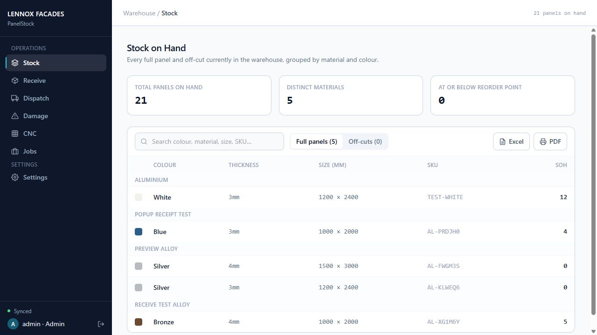

## 2. Receiving stock

### Material already in the catalog

1. Open Receive. Search by colour, material, thickness, size or SKU, then select the correct full-panel material.

2. Enter the Quantity received as a positive whole number. Add a Supplier / PO reference if available.

3. Check the material, size and physical delivery quantity, then select Add to SOH. Confirm the stock total and sync status. This adds to existing stock; it does not replace the total.

### Material missing from the catalog - users and admins

1. In Receive, select Add missing material. This works even when the catalog is empty. The popup is manual entry only; there is no material search list inside it.

2. Enter Colour / finish, Material, Thickness (mm), Width (mm) and Height (mm). Use the full sheet size being received. Dimensions must be positive.

3. Optionally enter a Reorder point, as a whole number of zero or more. Blank means zero for a new material.

4. Enter Quantity received and, optionally, Supplier / PO reference within the same popup.

5. Select Receive stock. A new material receives a SKU, and its catalog entry and stock quantity are saved together with the receipt record. You do not need to enter the quantity again on the main Receive screen.

> If the same material, colour and dimensions already exist, the receipt uses that catalog item instead of creating a duplicate. It adds to existing stock and does not change the existing reorder point.

### Checks and corrections

Fix any displayed validation errors before submitting. Quantity must be a positive whole number; negative and fractional receipts are rejected. Cancel or close the popup before saving to abandon the entry.

If a receipt was entered incorrectly, do not enter a second receipt to compensate. Ask an admin to review the activity and use the appropriate correction or void process. See section 8.

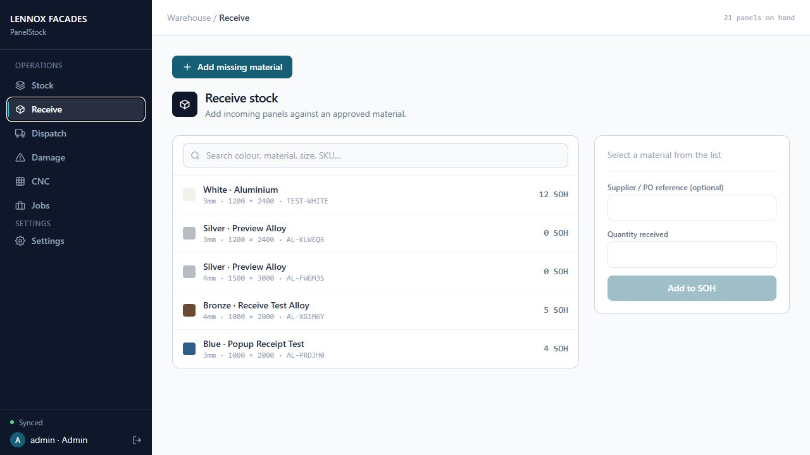

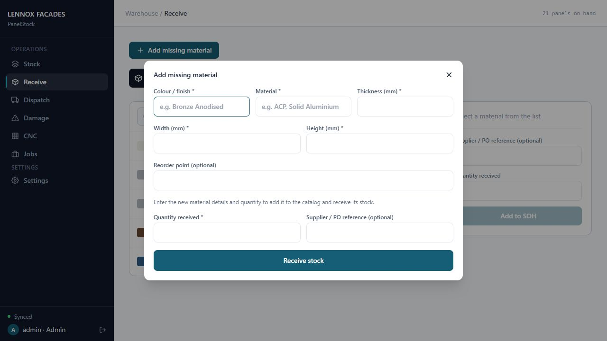

## 3. Stock, offcuts and exports

### View stock on hand (SOH)

1. Open Stock. Switch between Full panels and Off-cuts. Search for the material or SKU and check colour, thickness and size before taking stock.

2. Use the displayed SOH to compare with the physical count. Report discrepancies for review; do not silently adjust another material to balance the total.

### Add a usable offcut

1. Open Stock, choose Off-cuts and select the add-offcut control.

2. Optionally search for and select the original material. This fills colour, material and thickness. Alternatively, enter those details manually.

3. Enter the offcut piece's own Width and Height, Quantity and an optional Note. Do not leave the original full-sheet dimensions for a smaller piece.

4. Select Add off-cut. Check the new offcut entry and sync status.

> Adding an offcut does not dispatch its parent full sheet. Record the full-sheet stock movement separately when it is used. Do not count the same physical material both as a full sheet and as an offcut.

### Excel and PDF exports

Use Excel or PDF on the relevant screen for stock, catalog or activity information. Ordinary exported reports are snapshots at export time; download another copy when you need a later snapshot.

The CNC shared Excel workbook is different: it has a read-only refresh connection. Follow section 6 for its setup, colours and refresh behaviour. Do not expect stock exports to refresh like the CNC workbook.

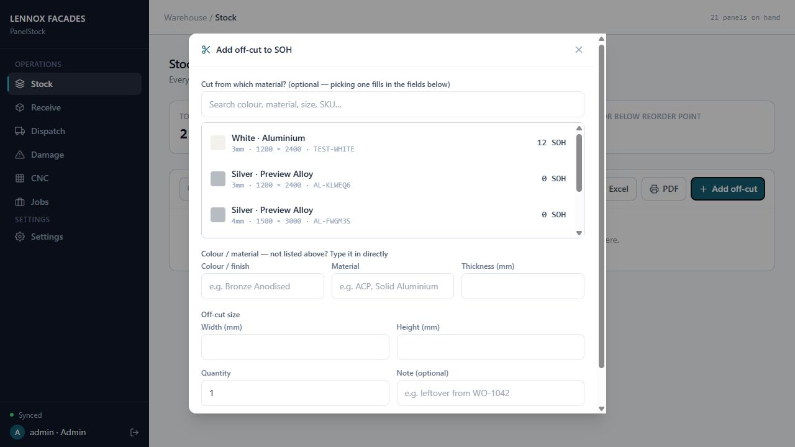

## 4. Dispatch, damage and job history

### Dispatch stock to a job

1. Open Dispatch. Search and select the exact full-panel or offcut item being issued.

2. Enter the order number, optional job reference and quantity to dispatch. Verify the available SOH and the physical material.

3. Select Confirm dispatch, then verify the reduced SOH and saved activity. If a usable offcut remains, add it separately using section 3.

### Write off damaged stock

1. Open Damage and select the affected item. Choose the reason and enter the quantity damaged.

2. Add at least one clear photo of the damage. Photo evidence is required before the write-off can be saved.

3. Select Write off stock. Confirm that the quantity was deducted from the correct item. The reason and photos support the damage record.

> Do not dispatch and write off the same quantity twice. Check item type, size and quantity before confirming each movement. Ask an admin to review mistakes rather than deleting evidence or repeating the action.

### Review jobs and activity

Use Jobs to find dispatch history by order or job reference. Use the activity controls available in Settings to review receipts, dispatches, damage and other recorded actions. Check timestamps and the recorded user when investigating a discrepancy.

Activity history is retained. Admin voids are recorded against eligible entries rather than silently removing history. See section 8.

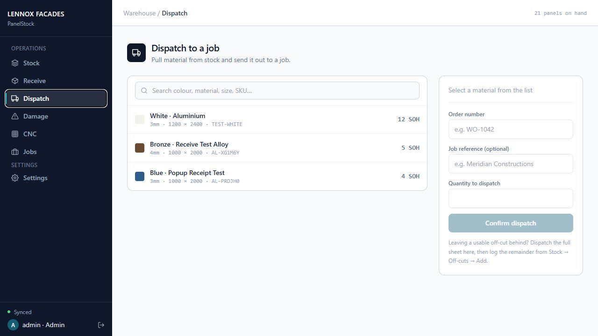

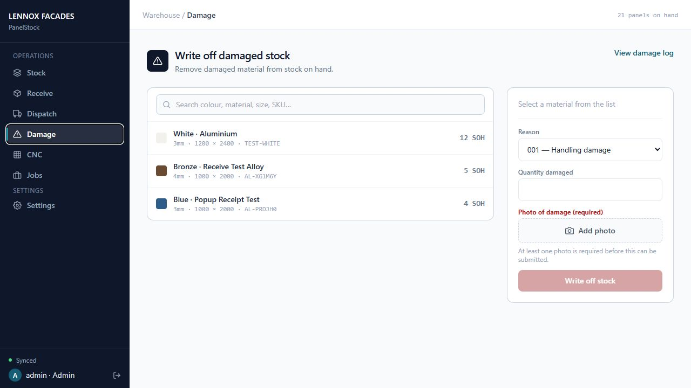

## 5. CNC scheduling and completion

### Schedule panels - admins

1. Open CNC. For one panel, use Schedule panel; enter the order, optional job reference, sheet and panel ID, then add it to the schedule.

2. For several panels, use Bulk entry. Enter Order number and Job reference once; both are required for bulk entry.

3. Enter Sheet number and Panel ID on each row. Use + Add line for more rows and the red trash icon to remove a row. There are no spreadsheet files to upload.

4. Select Schedule N panels. Completely blank lines are ignored; incomplete lines and repeated sheet/panel pairs block the batch until corrected.

New job references use title case. An order label such as Order #001234 becomes 001234, preserving leading zeros. A leading letter in a panel ID is capitalized. Other characters in identifiers are not globally converted.

### Find and complete work - users and admins

1. Expand the job reference, then its order. Orders appear highest number first within each job. Search and Pending/Completed filters help narrow the list.

2. For a single panel, select Complete panel. Review the order, sheet and panel ID in the confirmation, then confirm. Cancel or Escape leaves it unchanged.

3. For all pending panels on that order and sheet, select Complete sheet above Complete panel. Review every listed panel ID, scrolling if needed, then confirm.

> Complete sheet includes pending panels hidden by the current search and all matching order/sheet records. Already completed panels and other sheets remain unchanged. CNC completion records progress only: it does not deduct warehouse stock.

After completion, check the Completed view. Do not mark a sheet complete until every panel shown in the confirmation has actually been completed.

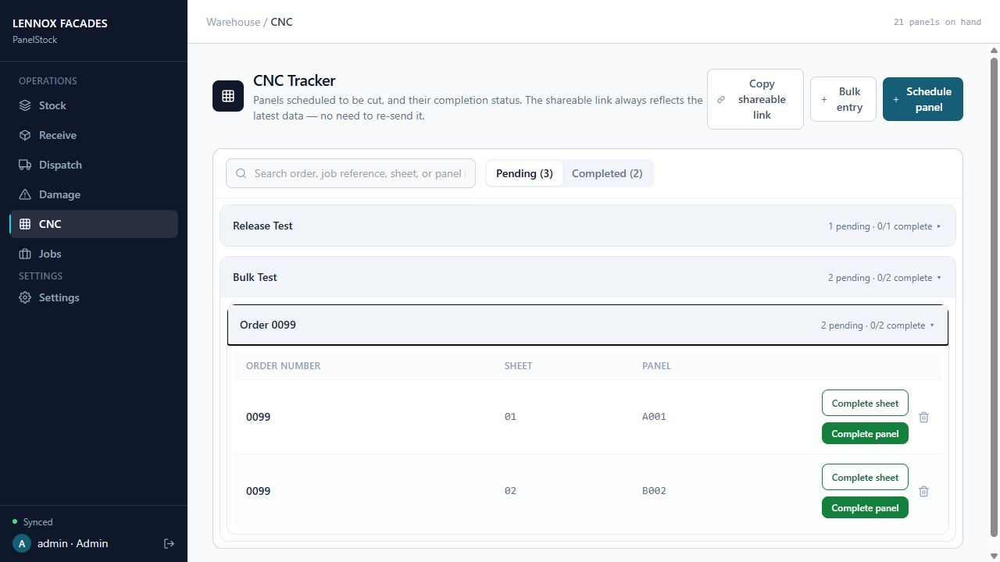

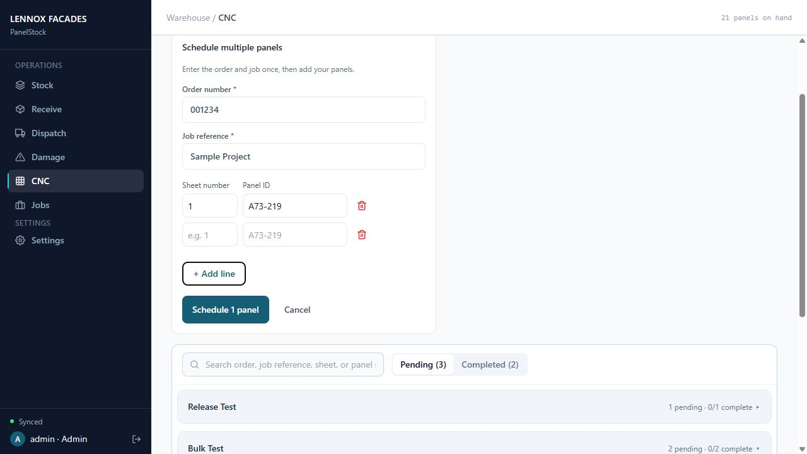

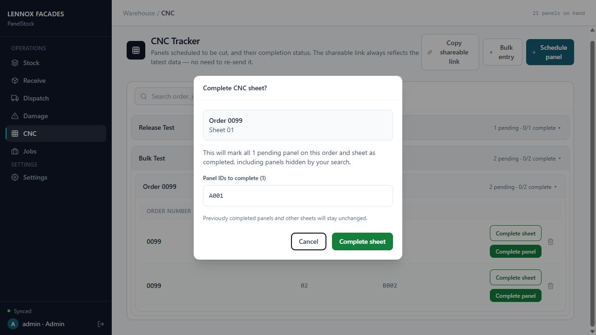

## 6. Shared CNC tracker and live Excel

### Share a read-only live view

1. In CNC, select Copy shareable link and send it only to intended viewers. The same link reflects updated CNC data; it does not need to be regenerated for every upload or completion.

2. Open the link in a phone or desktop browser. Expand job/order groups, use search and status filters, or Expand all / Collapse all. Watch for connection warnings; a disconnected view may be stale.

The shared page is read-only. It cannot complete panels or change stock. Use the signed-in app to record work.

### Set up the connected workbook

1. From the shared tracker, select Excel and open the downloaded workbook in desktop Microsoft Excel.

2. If you trust the PanelStock source, allow editing and the workbook data connection when Excel prompts. Do not lower global Trust Center security settings. The workbook contains no macros.

3. Keep Excel open. The connection refreshes on opening and every minute while the workbook is open. Check Excel's connection or refresh messages if it stops updating.

### Status colours

Completed rows are green. Pending rows are yellow. The colour applies across all eleven exported columns and updates when the status refreshes. Headers and blank rows are not coloured.

> If you downloaded a workbook before the status-colour update, download it once again using Excel to receive the conditional-formatting rules. That new copy then continues refreshing; routine changes do not require another download.

Identifiers such as order numbers and panel IDs remain text so leading zeros are preserved. An empty schedule clears old data rows after refresh. Edits made inside Excel do not update PanelStock.

The workbook contains the read-only sharing link. Treat both the workbook and link as access to CNC information. For mobile/browser viewing, use the shared tracker rather than relying on desktop Excel refresh.

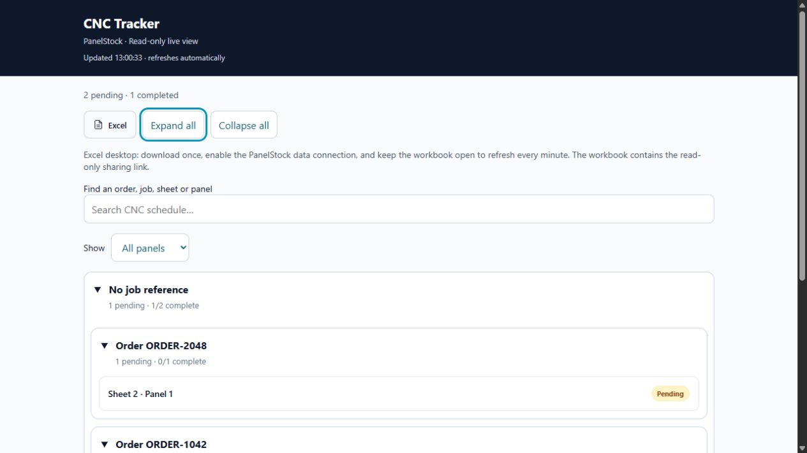

## 7. Materials catalog - administrators

### Single-item management

1. Open Settings and Materials Catalog. Use Add material for one catalog entry, or the edit control to correct an existing entry.

2. Enter colour/finish, material, thickness, width, height and optional reorder point. Verify dimensions in millimetres before saving.

A new catalog entry created in Settings receives a SKU and a zero-quantity stock entry. Creating catalog entries here is not a receipt. Use Receive when physical stock arrives.

### Bulk entry - no spreadsheet import

1. Select Bulk entry. Enter the required Material and Colour once for the batch.

2. Add rows for Thickness, Width, Height and Reorder point. Use + Add line for another size or the red trash icon to remove a row.

3. Leave reorder point blank to use zero. Dimensions must be positive; reorder point must be a whole number of zero or more.

4. Select Add N catalog items. Empty rows are ignored. Incomplete values and duplicate material/colour/size combinations in the catalog or batch must be corrected before the entire batch can be saved.

### Permission boundary

Regular users do not gain Settings catalog-management access. They can create a missing material only through a matching stock receipt in Receive. They cannot edit or delete catalog entries, alter stock-type details or use admin-only catalog bulk entry.

> Use the correct existing catalog item wherever possible. Do not create alternate spellings for the same material. Review downstream stock and job records before editing or removing catalog items.

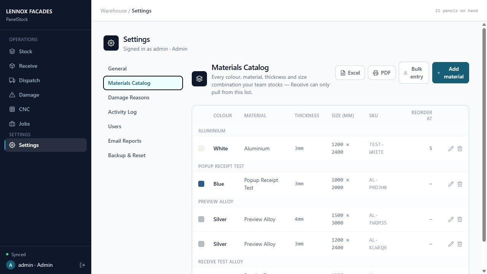

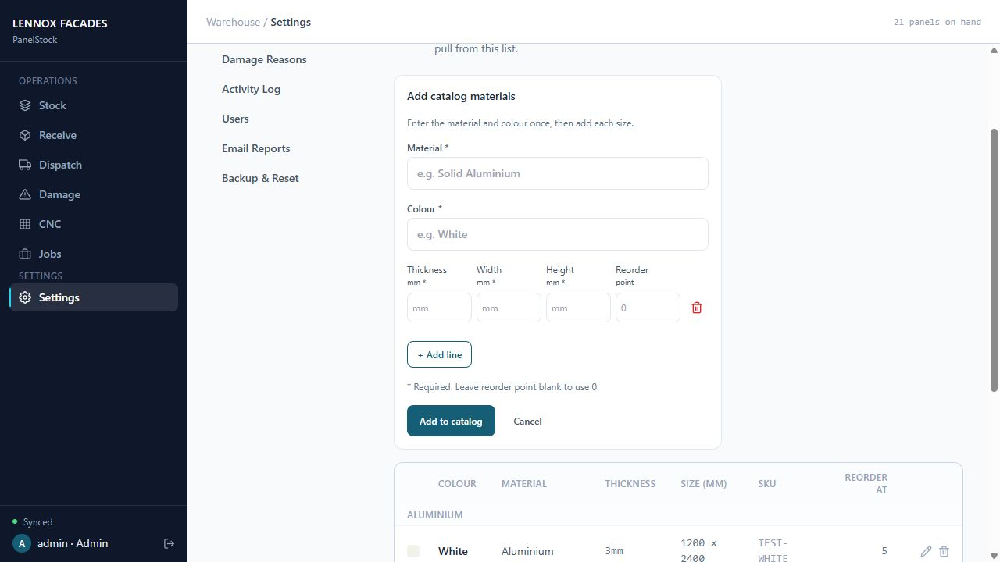

## 8. Stocktake, corrections and admin settings

### Stocktake procedure

1. Plan the count and pause normal stock movements. An admin takes a backup before using the Stocktake reset controls in Settings.

2. Follow the reset confirmation. Stocktake reset sets full-panel quantities to zero and clears offcuts; catalog entries, reasons and prior activity remain. The reset is logged.

3. Count the physical warehouse by material, colour, thickness and dimensions. Users and admins enter counted full-panel quantities through Receive, and offcuts through the offcut form.

4. Reconcile discrepancies and confirm all devices have synced before normal movements resume.

### Void an incorrect movement - admins

Open Settings > Activity Log. Identify the exact entry and review its effect before using VOID where available. Confirm the action and check the resulting SOH. A void reverses the eligible stock effect while retaining the original entry and void details. If blocked by current stock or conflicts, review with the administrator; do not force a duplicate correction.

### Damage reasons and users - admins

Manage damage reasons in Settings. Add or remove reasons using the displayed controls; existing damage history remains the record of what occurred.

Open Settings > Users. Use the current registration code for new staff. Admin controls can change that code, grant/revoke admin access, reset a PIN or remove a user. Reset PIN returns that user to the current registration code and revokes existing sessions; have them choose a new personal PIN. Never share an admin login.

### Email reports - admins

In the email-report settings, review recipients, days, time and timezone. Enable the schedule and save it, then use the test-send control to verify delivery. Scheduled reports run on the server; users do not need to leave an app open.

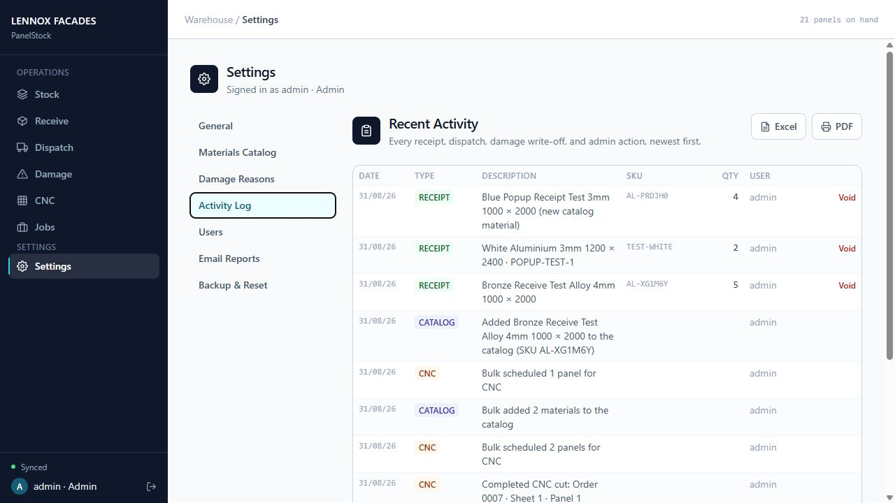

## 9. Backups, resets and sync recovery

### Back up before high-impact actions - admins

Use the backup controls in Settings before stocktakes, restores or major catalog changes. Keep exported backup files securely: they contain business data. Automated server snapshots are taken daily and normally retained for 14 days.

### Restore a reviewed backup - admins

1. Pause stock changes across devices. Review the selected backup date and make a current backup before proceeding.

2. Use the available restore controls and follow the confirmation. If stock changes after the reviewed snapshot, refresh and review again rather than forcing the restore.

3. A server backup restore restores stock/catalog and the saved operational collections, but preserves current activity history and records the restore. User accounts and credentials are not rolled back.

4. Refresh devices after a restore. Earlier queued changes can be blocked because they were made against the old state; reconcile them before any retry.

### Full reset is not routine housekeeping

Only admins should use Full reset, after a backup and a deliberate review of the confirmation. It clears catalog and stock, restores default damage reasons and preserves prior activity with a reset record. It is not a way to erase audit history or remove user accounts.

### Pending changes or sync conflict

1. If the app says changes are saved on this device or waiting to sync, keep the device and account available and check the connection. Do not assume the update is visible to other users yet.

2. If edits are blocked, read the message. Use Export pending changes when offered and keep the export for reconciliation. Do not clear browser storage, reinstall the app or discard pending work before it has been reviewed.

3. Only one tab may edit the app on a device at a time. Close another editing tab if instructed. If a session expired, sign in as the owner of the queued changes.

> Discarding local pending changes does not apply them to shared stock. Use that control only after the export is saved and the discrepancy has been reconciled. Contact an admin when the correct stock state is uncertain.

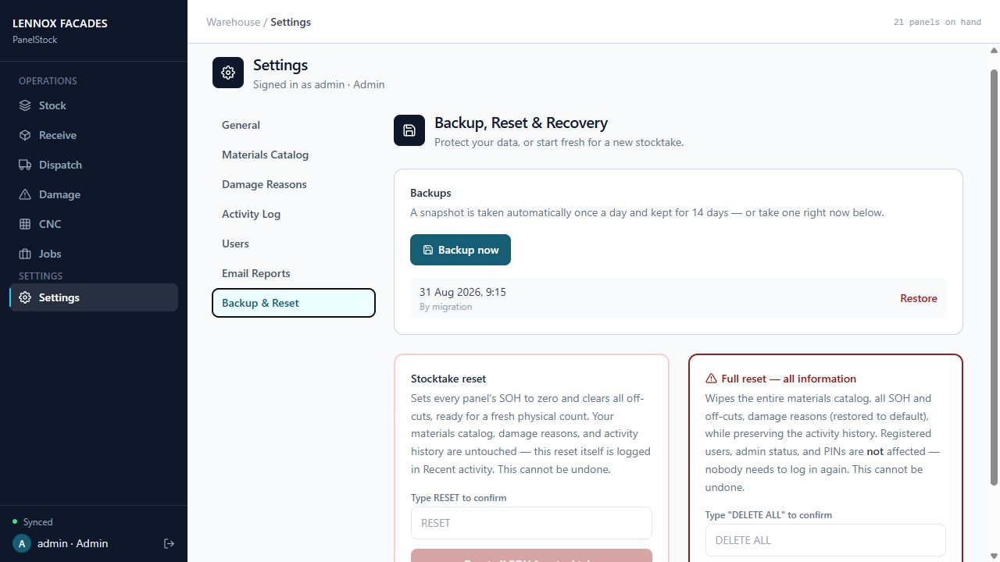
