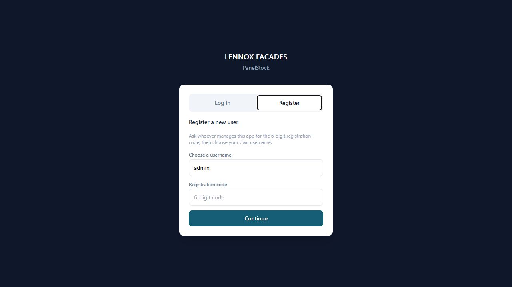
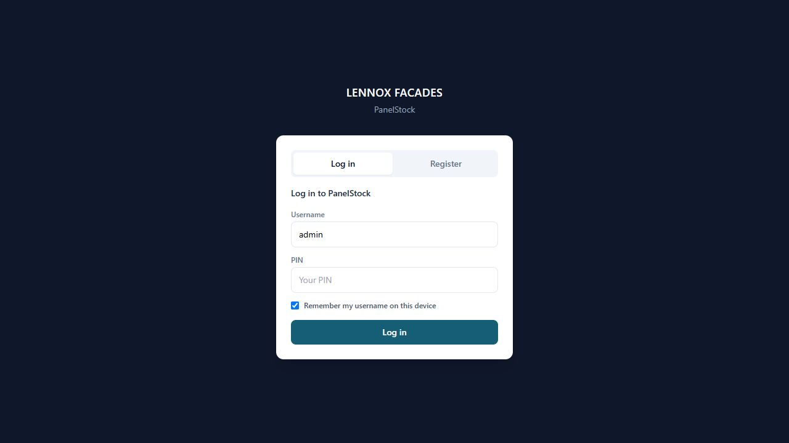
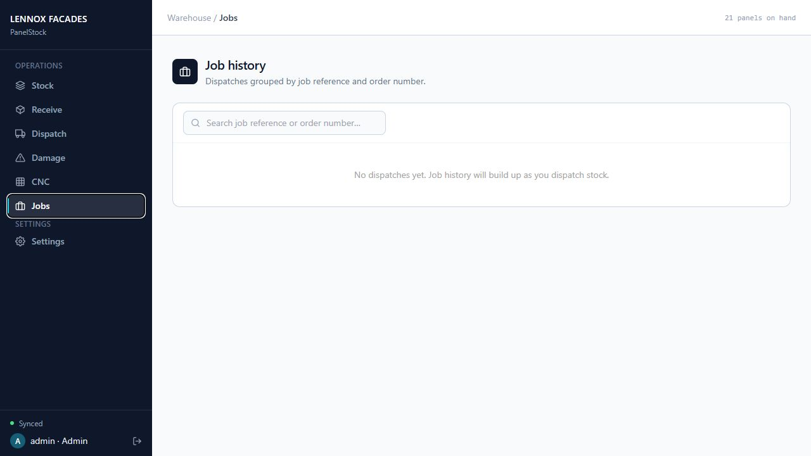
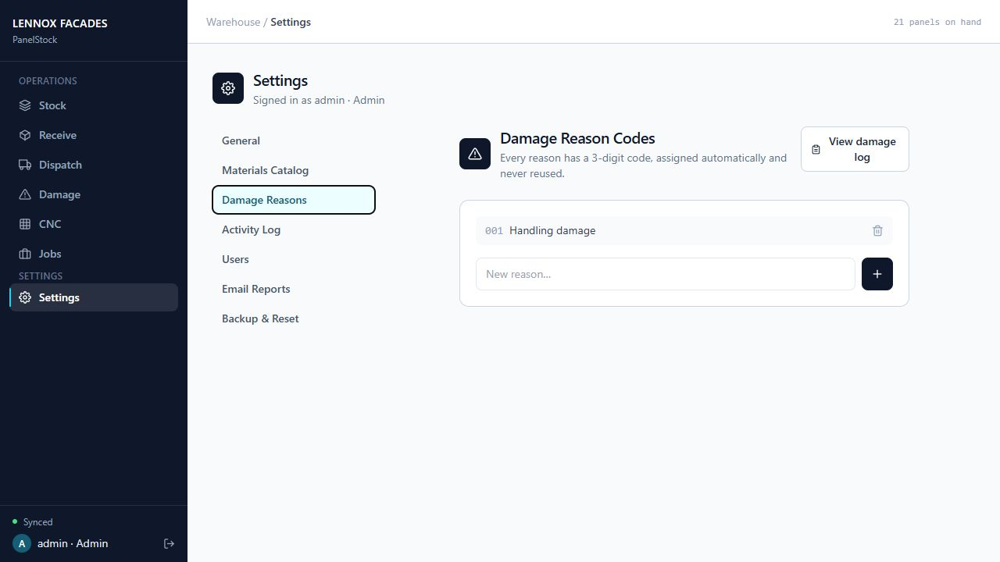
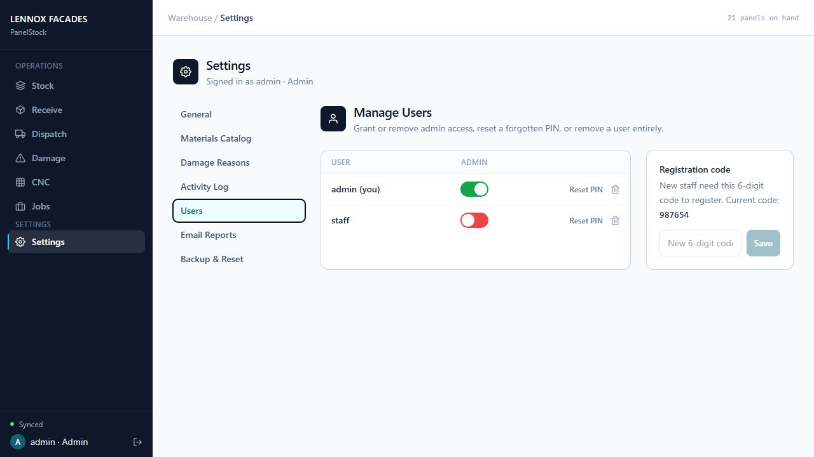
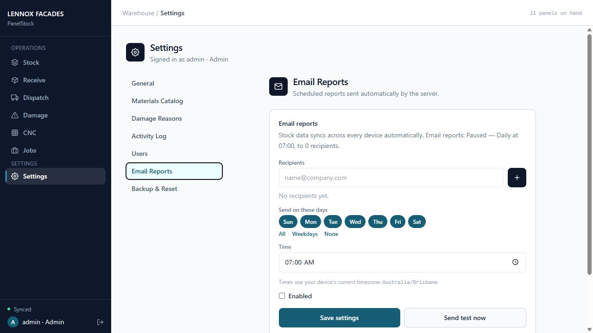

# PanelStock SOP - Desktop
Original-style edition | Updated 31 August 2026

## 2. Logging In & Registering

First time using PanelStock on this device

1. Open the app, then select <b>Register</b>.
2. Enter your own <b>username</b>. Use a separate account for each staff member.
3. Enter the current <b>six-digit registration code</b> supplied by an admin.
4. Select <b>Continue</b>, then choose and confirm a unique <b>6-12 digit personal PIN</b>.

> Keep your personal PIN private. Never put it in job notes or share an admin login.

## Returning after the app has logged you out

Use your own account so stock changes and CNC completions are attributed to you.

1. Select the <b>Log in</b> tab.
2. Check the <b>username</b>. If changes are waiting to sync, sign in as the account that created them.
3. Enter your personal <b>PIN</b> and select <b>Log in</b>. Ask an admin for a PIN reset if you have forgotten it.
4. On a shared device, turn off <b>Remember my username</b> if appropriate and log out when finished.

> A saved username is not a shared account. Check the sync status before leaving the device.

## 3. Viewing Stock & Exporting Reports

Check stock on hand before taking or receiving material.

1. Open <b>Stock</b>. Choose <b>Full panels</b> or <b>Off-cuts</b>.
2. Search by colour, material, thickness, size or SKU. Check the exact item before using it.
3. Read the displayed <b>SOH</b> and compare it with the physical stock. Report discrepancies for review.
4. Use <b>Excel</b> or <b>PDF</b> to export a report. Ordinary stock exports are snapshots, not live workbooks.

> The shared CNC Excel workbook is different: it refreshes while open. See Section 16.

## Adding an off-cut

Use this when a job leaves a usable leftover piece worth keeping in stock.

1. Open <b>Stock</b>, choose <b>Off-cuts</b>, then select <b>Add off-cut</b>.
2. Optionally select the original material to fill its details, or enter colour, material and thickness manually.
3. Enter the offcut's own <b>Width</b> and <b>Height</b> - usually smaller than the original sheet.
4. Enter the <b>Quantity</b> and an optional <b>Note</b>.
5. Select <b>Add off-cut</b>. Scroll within the form if the button is below the visible area.

> Adding an offcut does not dispatch its parent sheet. Record that full-sheet movement separately.

## 4. Receiving Stock

Use this whenever new panels physically arrive at the warehouse.

1. Open <b>Receive</b> in the app navigation.
2. Search for the material, colour, thickness or SKU, then select the exact item you're receiving.
3. Optionally enter a <b>Supplier / PO reference</b>.
4. Enter the <b>Quantity received</b> as a positive whole number.
5. Select <b>Add to SOH</b>. Check the new total and the sync indicator.

> If the material is not in the catalog, use Add missing material. Both users and admins can do this.

## Adding missing material while receiving

Create the missing material and receive its stock in the same popup.

1. In <b>Receive</b>, select <b>Add missing material</b>. It is available to users and admins, even with an empty catalog.
2. Enter <b>Colour / finish</b>, <b>Material</b>, <b>Thickness</b>, <b>Width</b> and <b>Height</b>. Use positive dimensions in millimetres.
3. Optionally enter a whole-number <b>Reorder point</b>. Blank uses zero for new materials.
4. Enter the <b>Quantity received</b> and optional <b>Supplier / PO reference</b> in this popup.
5. Select <b>Receive stock</b>. The catalog item, stock and receipt record are saved together.

> If a matching material already exists, its stock is increased without creating a duplicate. Existing reorder points are preserved.

## 5. Dispatching to a Job

Use this whenever material is pulled from stock and sent out to a job.

1. Open <b>Dispatch</b>. Search and select the correct full panel or offcut.
2. Enter the <b>Order number</b> and optional <b>Job reference</b>.
3. Enter the <b>Quantity to dispatch</b>. Check available SOH and the physical item.
4. Select <b>Confirm dispatch</b>, then verify the reduced SOH and sync status.

> If a usable piece remains, add it through the offcut form. Do not count the same material twice.

## 6. Writing Off Damaged Stock

Use this when damaged material must be removed from stock on hand.

1. Open <b>Damage</b> and select the affected stock item.
2. Choose the <b>Reason</b> and enter the <b>Quantity damaged</b>.
3. Use <b>Add photo</b> to attach at least one clear photo of the damage. Evidence is required.
4. Select <b>Write off stock</b>. Confirm the deduction from the correct item.

> Do not dispatch and write off the same quantity twice. Ask an admin to review incorrect movements.

## 7. Job History

Use this to review past dispatches, grouped by job.

1. Open <b>Jobs</b> to find dispatch history by job reference or order number.
2. Review the relevant job and its material movements. Check quantities and timestamps.
3. For receipts, damage and other actions, open <b>Settings &gt; Activity Log</b>. The recorded user helps identify who made the entry.

> Job history and activity are records of previous actions. Use current SOH to check what is available now.

## 8. Stocktaking Procedure

Plan the physical count before resetting quantities.

1. Pause normal stock movements. An <b>admin</b> takes a backup before starting the count.
2. Use <b>Stocktake reset</b> in Settings and follow its confirmation. Full-panel quantities become zero and offcuts are cleared.
3. Count the warehouse by material, colour, thickness and dimensions. Users and admins enter counted panels through <b>Receive</b>.
4. Enter usable offcuts through the offcut form. Reconcile discrepancies and confirm all devices have synced before resuming work.

> Stocktake reset preserves the catalog, damage reasons and prior activity. The reset itself is logged.

## 9. Voiding a Mistaken Entry

Reverse an eligible stock movement without removing the audit history.

1. Open <b>Settings &gt; Activity Log</b>. Find the exact receipt, dispatch or damage entry.
2. Check the item, quantity, date and recorded user before using <b>Void</b>.
3. Review and confirm the reversal. Check the resulting SOH.
4. If blocked by stock or a conflict, investigate first. Do not force a duplicate correction.

> Voiding preserves the original entry and records its reversal. It does not silently delete history.

## 10. Settings: Materials Catalog

Manage the approved material, colour and size combinations.

1. Open <b>Settings</b> and <b>Materials Catalog</b>.
2. Use <b>Add material</b> for one new entry, or the edit control to correct an existing entry.
3. Enter colour, material, thickness, width, height and optional reorder point. Check all dimensions in millimetres.
4. Save the item. New catalog entries made here start with <b>zero stock</b>. Receive physical deliveries separately.

> Regular users can add missing material only with a matching receipt in Receive. Catalog editing and deletion remain admin-only.

## Adding catalog materials in bulk

Enter multiple sizes in the app; no spreadsheet import is needed.

1. In the catalog, select <b>Bulk entry</b>. Enter the required <b>Material</b> and <b>Colour</b> once.
2. Add rows for <b>Thickness</b>, <b>Width</b>, <b>Height</b> and optional <b>Reorder point</b>.
3. Use <b>+ Add line</b> for another size and the <b>red trash icon</b> to remove a row. Blank reorder points use zero.
4. Select <b>Add N catalog items</b>. Correct incomplete values and duplicates before saving the whole batch.

> Dimensions must be positive. Duplicate material/colour/size combinations are rejected. New items start with zero stock.

## 11. Settings: Damage Reason Codes

Maintain the reasons used when recording damaged stock.

1. Open <b>Settings</b> and the damage-reasons controls.
2. To add a reason, enter its description and use the add control.
3. To remove a reason, use its trash icon. Review the choice before confirming.

> Existing damage records retain the reason recorded at the time. Use the damage log to review past write-offs.

## 12. Settings: Users

Give every staff member their own account.

1. Open <b>Settings &gt; Users</b>. Give new staff the current registration code so they can register their own account.
2. Use the admin control to grant or revoke admin access only where required.
3. Use <b>Reset PIN</b> for a forgotten PIN. It resets that user to the current registration code and revokes existing sessions.
4. Have the user choose a new personal PIN. Use the remove-user control only when their access should end.

> Keep registration codes and PINs out of screenshots, job notes and shared messages. Never share an admin login.

## 13. Settings: Email Reports

Set the report recipients and delivery schedule.

1. Open the <b>email-report settings</b> in Settings.
2. Review recipient email addresses and choose the days reports should be sent.
3. Set the time and check the displayed <b>timezone</b>.
4. Enable the schedule and <b>save settings</b>.
5. Use the <b>test-send</b> control to verify delivery to the intended recipients.

> Scheduled reports run on the server. Nobody needs to leave an app open for delivery.

## 14. Settings: Backup & Recovery

Back up before stocktakes, restores or major catalog changes.

1. Open the <b>backup controls</b> in Settings. Take a current backup before any high-impact action.
2. Review the backup date before choosing <b>Restore</b>. Pause stock changes across devices.
3. Follow the restore confirmation. If stock changes after your review, refresh and review again.
4. Refresh other devices after the restore and reconcile any pending changes created against the old state.

> Daily snapshots are normally retained for 14 days. Server restores preserve current activity history and do not roll back user credentials.

## Stocktake reset & Full reset

These controls have different effects. Read the warning before proceeding.

1. <b>Stocktake reset</b> sets full-panel SOH to zero and clears offcuts. Catalog entries, reasons and history remain.
2. <b>Full reset</b> clears catalog and stock and restores default damage reasons. Prior activity is retained with a reset record.
3. User accounts and PINs are not removed by these stock resets.
4. Make a backup first and follow the displayed confirmation phrase. Do not use reset controls as routine housekeeping.

> A reset is not a way to erase audit history. Only admins should perform it after a deliberate review.

## Pending changes & sync recovery

A local save is not confirmation that other devices have received the change.

1. Check the connection and sync indicator. Keep the device and the account that created pending changes available.
2. If offered, use <b>Export pending changes</b> and save the export for reconciliation.
3. Do not clear browser storage, reinstall or discard pending work before it has been reviewed.
4. Only one tab may edit on a device at a time. Close another editing tab if instructed; sign back in as the owner of queued changes.

> Discarding pending changes does not apply them to shared stock. Contact an admin if the correct state is uncertain.

## 15. CNC Tracker

Find scheduled work by job reference, order, sheet or panel.

1. Open <b>CNC</b>. Expand the <b>job reference</b>, then its <b>order</b>. Orders appear highest number first within each job.
2. Use search and the <b>Pending / Completed</b> filters to find the required work.
3. Use <b>Complete panel</b> for one panel, or <b>Complete sheet</b> above it for the whole order/sheet.
4. Check the completion confirmation before saving. Only mark work completed after it has actually been cut.

> Users and admins can complete CNC work. Completion records progress only; it does not deduct warehouse stock.

## Scheduling CNC panels

Admins can schedule one panel or enter many panels together.

1. Use <b>Schedule panel</b> for a single panel, or <b>Bulk entry</b> for several.
2. For bulk entry, enter the required <b>Order number</b> and <b>Job reference</b> once.
3. Enter <b>Sheet number</b> and <b>Panel ID</b> on each row. Add lines as needed; use the red trash icon to remove a row.
4. Select <b>Schedule N panels</b>. Blank rows are ignored; incomplete or repeated sheet/panel pairs must be corrected.

> Job references use title case. An order label such as Order #001234 becomes 001234. A leading panel-ID letter is capitalized.

## Confirming a panel or sheet

The confirmation lists the panel IDs affected by your action.

1. <b>Complete panel</b> asks you to confirm the individual panel ID.
2. <b>Complete sheet</b> lists every pending panel for that order and sheet. Scroll through the whole list if necessary.
3. The sheet action also includes matching panels hidden by your search. Already completed panels and other sheets stay unchanged.
4. Confirm only when all listed work is complete, or choose <b>Cancel</b> to leave it unchanged.

> The pictured example contains one pending panel. A sheet with several pending panels lists all of their IDs.

## 16. Shared CNC Tracker & Excel

Share a read-only view that stays up to date.

1. In CNC, select <b>Copy shareable link</b>. Send it only to intended viewers.
2. Open the link on a phone or desktop. Expand job/order groups and use search or status filters.
3. Select <b>Excel</b> to download the connected workbook. Open it in desktop Microsoft Excel.
4. If you trust the source, allow editing and its data connection when prompted. Keep Excel open for the one-minute refresh.

> The shared page and workbook are read-only. Edits in Excel do not change PanelStock. Treat the link and workbook as access to CNC information.

## Excel refresh & status colours

One connected workbook can refresh without repeated downloads.

1. <b>Completed</b> rows are green and <b>Pending</b> rows are yellow across all eleven exported columns.
2. Colours update with refreshed statuses, including newly added rows. Headers and blank rows are not coloured.
3. Download an older workbook once again to receive the new colour rules. Routine changes then refresh without another download.
4. If refresh stops, check Excel connection messages. Do not lower global Trust Center security settings. The workbook contains no macros.

> Refresh runs on opening and every minute while desktop Excel is open. On mobile, use the shared browser tracker.

